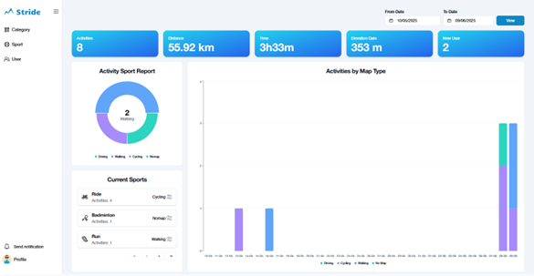
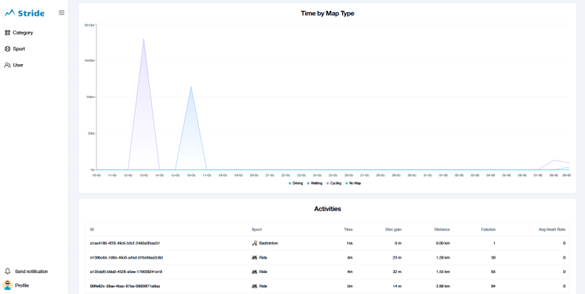
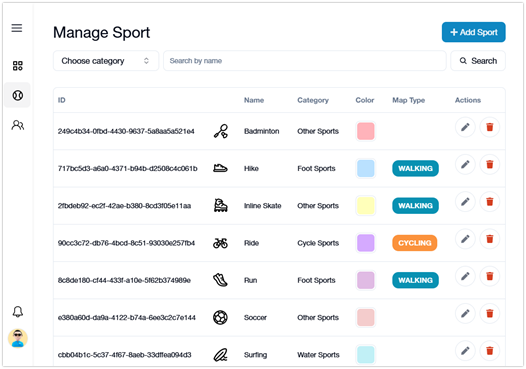
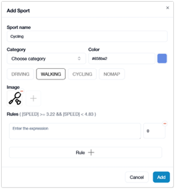
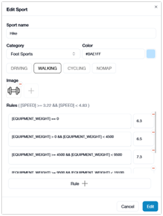
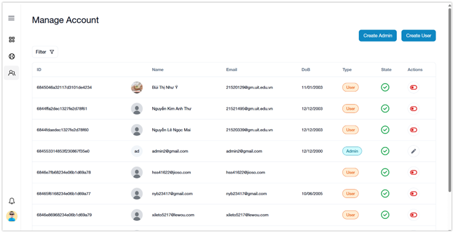

# Admin Dashboard for Stride

This is a simple admin web app built with Next.js to manage user data and visualize activity statistics for the Stride app.

## Features

- Display activity charts and statistics
- User management (view, edit user info)
- Sport and category management (create, edit, delete)
- Clean, responsive UI with Shadcn and TailwindCSS
- Fully validated form using react-hook-form

## Screenshots

### Admin Dashboard


<br> <br>


### Sport Management


<br> <br>



### User Management



## Getting Started

First, run the development server:

```bash
npm run dev
# or
yarn dev
# or
pnpm dev
# or
bun dev
```

Open [http://localhost:3000](http://localhost:3000) with your browser to see the result.

## Environment Variables

Create a `.env` file in the project root and add the following:

```env
NEXT_PUBLIC_API_BASE_URL=[YOUR_API_ENDPOINT]
```
